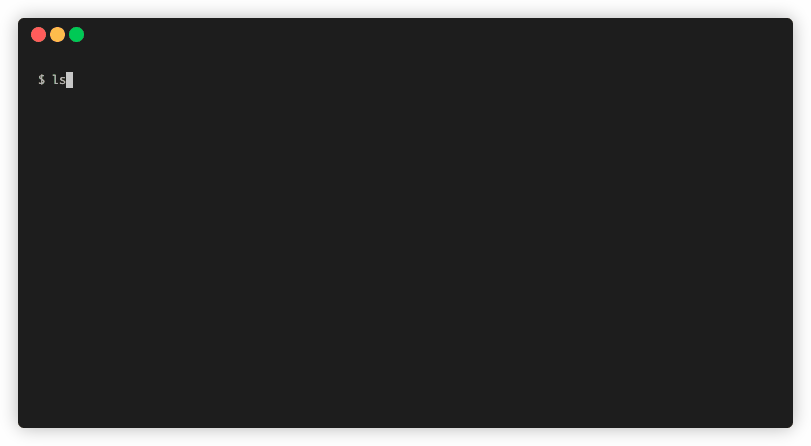

# Tips and suggestions <!-- omit in toc -->

Some general comments, tip, and suggestions for this lab.

- [Using `^D` to terminate input](#using-d-to-terminate-input)
- [Correctness](#correctness)
- [Style and clarity: The big issues](#style-and-clarity-the-big-issues)
- [Style and clarity: Odds and ends](#style-and-clarity-odds-and-ends)

## Using `^D` to terminate input

The "main" functions (`main.c` in both projects) expect you to type input at
the keyboard and will keep running until you "tell" them that you're done typing.
In Unix-based systems typing `^D` (control-D) generates an
`EOF` (end-of-file) character, which the operating system reads as a request
to terminate the input.

:warning: Note that `^C` is _not_ the same as `^D`. `^C` terminates the
program right away, preventing it from doing any finalization or clean-up.
`^D` just says that we're done providing input. That tends to end the loop
that's reading the input, but doesn't affect the code that comes after that.

In the terminal session below, the `./palindrome` program would run forever
waiting for additional input if we didn't type `^D` to tell it that
we're done providing input.

> Note that we also show the use of I/O redirection (`< sample_input.txt`).
> The operating system "knows" when the file ends, so this automatically
> terminates without us having to do anything special (like enter `^D`).

The use of `^D` also applies when you're running `valgrind` on
the main functions. :warning: Here you _definitely_ don't want to
use `^C`, as that will terminate `valgrind` and prevent it from
finalizing its analysis after your program stops running.

## Correctness

The one non-subtle issue that has come up in several places was that
people simply failed to free temporary memory they'd allocated.
`valgrind` is very good about catching these kinds of problems, so
there's really no reason for not finding and fixing those problems.

People often got lost in their array indices, and some remain
lost there throughout. This (and the next) lab have some exercises
where loop invariants could be really useful in helping you stay clear
about what you know and where.

People sometimes use a variable before they've initialized it.
Typically this was a counter that needed to be initialized to 0, but
never was. Unlike Java, C makes no promises about how variables will
be initialized, so you have to make sure that you initialize them
properly. (One can make a strong case for not assuming any
particular initialization in Java and being explicit about it there
as well.) Unfortunately leaving out initialization like this can be
very tricky to find, because tests can (often) pass and code can
appear to work just fine if you get lucky. Since the initial value of that
variable can depend on what other function calls have been made and
what values they've left behind in memory, however, the code can then
fail in other circumstances and environments.

People sometimes have off-by-one errors where they weren't allocating
space for the null terminator on their result strings. If, for example,
you know you need enough space to store a string of N characters,
you need to make sure that you allocate *N+1* characters so there's
room for the null terminator at the end. This can be tricky to find
because the tests often still pass even if you make this make this
mistake. `valgrind` notices this problem and complains about
illegal reads and writes when we try to access the memory location
where the null terminator would need to be, but which we never
allocated space for.

## Style and clarity: The big issues

Please use decent variable names! C is a challenging language and
can be very hard to debug; don't make it worse by using charming
names like `result`, `res2`, and `res3` or `temp` and `temp2`.

Initialize variables where you use them. People sometimes declare
and initialized a variable up top, but then didn't use it for
3/4 of a page. This leaves the reader to hunt through the
intervening code to make sure it wasn't changed somewhere in
between. (Breaking things up into smaller functions would do much to
lessen this problem.)

Use functions to break things up! In the past, for example, many people
have had their vowel check in `disemvowel` as one huge long chain of `||` statements. Pull that stuff out into a named function, *especially* if
you end up repeating it!

## Style and clarity: Odds and ends

You should remove "debugging" print statements from "production"
code (i.e., working code that you turn in).

Don't `#include` `.c` files; you want to compile `.c` files
separately and link them in. (If this is confusing or unclear to
you, then you definitely should ask a question about it.) Because
`#include` is a purely textual operation, it will *work* on `*.c`
files, or `*.java`, or `*.rb`, or random JPEGs, but most of those
aren't good ideas. What one typically does is *only* include
the `*.h` files, which provide the headers but none of the
implementation details. You then compile all the `*.c` files,
as they provided the needed implementations, and the
linker pulls them all together into a working executable.

Pay attention to warnings, and ask if you don't understand what any
of them are saying. It's not uncommon for people to ask questions when the
compiler warnings are pointing right to the problem.

As appropriate, use C's `bool` type (with values `true` and `false`)
instead of `int`s with the values 0 and 1. Booleans are a lot more
readable and less error prone.
